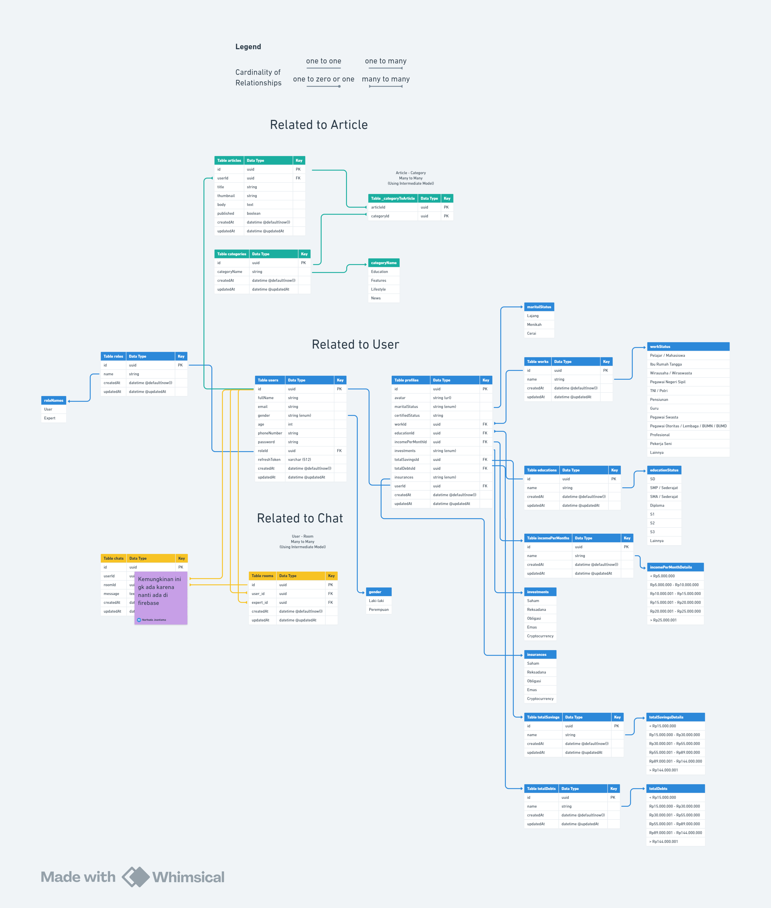
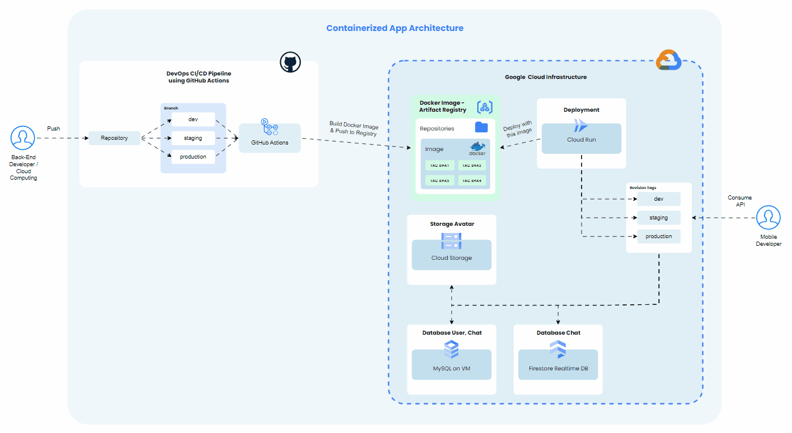
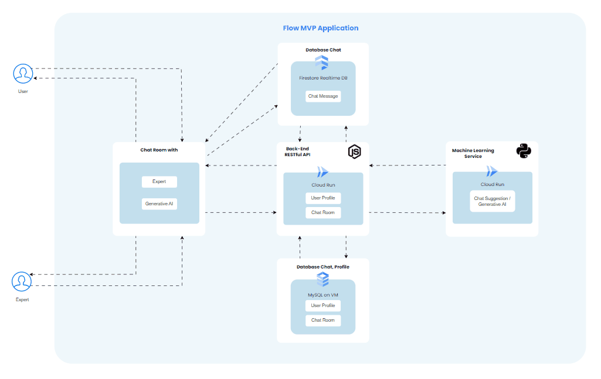

<h1 align="center">Finboost Back-End</h1>

<div align="center">

&nbsp;
&nbsp;
&nbsp;
&nbsp;
&nbsp;
&nbsp;
&nbsp;
&nbsp;
&nbsp;
&nbsp;
&nbsp;
&nbsp;
&nbsp;

</div>

<p align="center">This repository is the backend for a mobile application that aims to provide various features such as authentication, chat, and more. This backend is built using Express.js, Prisma, MySQL, Firebase, Zod, JWT, Docker, OpenAPI (Swagger), GitHub Acitons, Cloud Run, and Cloud Storage</p>

## Table of Contents

-   [Tech Stack](#tech-stack)
-   [Architecture File and Folder](#architecture-file-and-folder)
-   [Entity Relationship Diagram](#entity-relationship-diagram)
-   [Infrastructure Diagram](#infrastructure-diagram)
-   [Flow MVP Application](#flow-mvp-application)
-   [Running on Localhost](#running-on-localhost)
-   [Setting Up CI/CD Pipeline (GitHub Actions)](#setting-up-cicd-pipeline-github-actions)
-   [Prisma Cheatsheet](#prisma-cheatsheet)

## Tech Stack

-   [Express.js](https://expressjs.com) (`Framework`): Minimal and flexible Node.js web application framework that provides robust set of features for web and mobile applications. APIs.
-   [Prisma](https://www.prisma.io) (`ORM`): Let your team ship features faster, and leave the database complexities to us (orm, schema, introspection, migration, seeding, studio).
-   [MySQL](https://www.mysql.com) (`Database`): Is an open-source relational database management system.
-   [Zod](https://zod.dev) (`Validation`): Zod is a TypeScript-first schema declaration and validation library. I'm using the term "schema" to broadly refer to any data type, from a simple `string` to a complex nested object. Zod is designed to be as developer-friendly as possible. The goal is to eliminate duplicative type declarations. With Zod, you declare a validator once and Zod will automatically infer the static TypeScript type. It's easy to compose simpler types into complex data structures.
-   [JWT](https://jwt.io) (`Auth/Token`): JSON Web Tokens are an open, industry standard RFC 7519 method for representing claims securely between two parties.
-   [Docker](https://www.docker.com) (`Container`): Docker is a platform designed to help developers build, share, and run container applications. We handle the tedious setup, so you can focus on the code.
-   [OpenAPI (Swagger)](https://www.openapis.org) (`Documentation`): The OpenAPI Specification, previously known as the Swagger Specification, is a specification for a machine-readable interface definition language for describing, producing, consuming and visualizing web services.
-   [Cloud Run](https://cloud.google.com/run?hl=en) (`Serverless`): For host the Node.js if using container deployment
-   [Compute Engine](https://cloud.google.com/products/compute?hl=en) (`Virtual Machine`): For installing database or web server if Node.js deployment not using container
-   [Cloud Storage](https://cloud.google.com/storage?hl=en) (`Object Disk`): For storing data objects (e.g. images, files, etc)
-   [GitHub Actions](https://docs.github.com/actions) (`CI/CD Pipeline`): Is used for DevOps CI/CD Pipeline if deployment using Cloud Run

## Architecture File and Folder

| File/Folder Name    | Description                                                                                                                                                                                      |
| ------------------- | ------------------------------------------------------------------------------------------------------------------------------------------------------------------------------------------------ |
| `src/app.js`        | Application starter, the entry point express application                                                                                                                                         |
| `src/routes/api.js` | List of route the RESTful Application, handle request method and mapping to the correct controller                                                                                               |
| `src/middleware`    | Middleware for verify the request before to the actual destination or controller, e.g. Bearer access token or upload file                                                                        |
| `src/controller`    | Folder that contain many controller file to handle the request from the route. In this controller, you can validate the request body and etc with Zod before sending request to the service file |
| `src/service`       | Folder that contain many service file to handle the request from the controller. In this service, you can define the business logic before sending query to the repository or database           |
| `src/repository`    | Folder that contain many repository file to handle query with some or no data from the service file. In this repository, you can define the query with prisma ORM to the database                |
| `src/schema`        | Folder that contain user input schema                                                                                                                                                            |
| `src/exceptions`    | Folder that contain handle error response, e.g. Validation error, Server error, Client error                                                                                                     |
| `src/utils`         | Folder that contain function utility to support the application                                                                                                                                  |
| `prisma`            | Folder that contain prisma configuration, e.g. Schema, Seeding, Migration                                                                                                                        |
| `db/prisma.js`      | File prisma client connection to connect to the database                                                                                                                                         |
| `.github`           | Folder that contain configuration of GitHub repository, e.g. GitHub Actions for CI/CD Pipeline                                                                                                   |

## Entity Relationship Diagram



## Infrastructure Diagram



## Flow MVP Application



## Running on Localhost

> **NOTE**: Before you running this application on your localhost, your computer must be authenticate with Google Cloud Project and make sure all of resource is already setup:
>
> -   Gcloud CLI
> -   Google Cloud Storage (for storing avatar user file)
>
> You can authenticate your local computer using ADC method or Service Account
>
> -   ADC
>
> ```bash
> gcloud auth application-default login
> ```
>
> -   Service Account
>
> ```bash
> gcloud auth activate-service-account --key-file=/path/to/serviceaccount.json --project=project-id
> ```

-   Clone this repository

```bash
git clone https://github.com/Finboost/finboost-backend.git finboost-backend
```

-   Setup environment file for development

```bash
cd finboost-backend && cp .env.example .env.dev
```

> **NOTE**: For the database setup, you can use `docker-compose.yml`, to run this yml file you can run with this command
>
> ```bash
> docker compose up -d
> ```
>
> Please consider port mapping the database, to ensure the Prisma connection has the correct `database_url`

After make a copy environment file from example, fill the `.env.dev` with your own configuration e.g. database url, api version, express port, jwt secret, gcloud project id & bucket name

> **NOTE**: For JWT access or refresh token secret, you can generate with this command
>
> ```bash
> npx run generate:secret:jwt
> ```

-   Install dependency application

```bash
npm i
npm i -g dotenv-cli
```

-   Generate Prisma Client and Run the Migration

> **NOTE**: For windows operating system, run with this command
>
> ```bash
> npm run migrate:dev:windows
> ```
>
> For more running command, you can check on `package.json`

```bash
npx prisma generate
npm run migrate:dev
```

-   Running the application

> **NOTE**: For windows operating system, run with this command
>
> ```bash
> npm run start:dev:windows
> ```

```bash
npm run start:dev
```

## Setting Up CI/CD Pipeline (GitHub Actions)

> **NOTE**: Before you setting up the CI/CD Pipeline, make sure all of the permission need on the Google Cloud Platform are already setup:
>
> -   Enable Cloud Run and Artifact Registry Service
>
> ```bash
> gcloud services enable run.googleapis.com
> gcloud services enable artifactregistry.googleapis.com
> ```
>
> -   Creating Repository for Artifact Registry
>
> ```bash
> gcloud artifacts repositories create [repository-name] --repository-format=docker --location=asia-southeast2
> ```
>
> -   Creating Dedicated Service Account for GitHub Actions
>
> ```bash
> export PROJECT_ID=$(gcloud config get-value project)
> export SA_NAME="github-actions"
> gcloud iam service-accounts create $SA_NAME --description="This service account is for authenticate GitHub Actions DevOps CI/CD Pipeline" --display-name="GitHub Actions"
> ```
>
> Add IAM policy binding to the Service Account
>
> ```bash
> gcloud projects add-iam-policy-binding $PROJECT_ID --member=serviceAccount:$SA_NAME@$PROJECT_ID.iam.gserviceaccount.com --role=roles/artifactregistry.admin
>
> gcloud projects add-iam-policy-binding $PROJECT_ID --member=serviceAccount:$SA_NAME@$PROJECT_ID.iam.gserviceaccount.com --role=roles/run.admin
>
> gcloud projects add-iam-policy-binding $PROJECT_ID --member=serviceAccount:$SA_NAME@$PROJECT_ID.iam.gserviceaccount.com --role=roles/iam.serviceAccountUser
> ```
>
> Creating JSON Key from that Service Account
>
> > **NOTE**: Please consider the content, this is sensitive data because with this key everybody can authenticate to the Google Cloud Project based on the role binding attached
>
> ```bash
> gcloud iam service-accounts keys create github-actions-service-account.json --iam-account=$SA_NAME@$PROJECT_ID.iam.gserviceaccount.com
> ```

-   Setup Actions Secrets

> **NOTE**: `XXX` mean the environment deployment, e.g. `dev`, `staging`, or `production`

You can setup your `.env.XXX` file to the Actions Secrets on GitHub Repository. The setup is very easy you can follow this guide:

1. Move to your Repository GitHub which will be store this application
2. Enter to the `Settings` tab
3. Scroll down and select from the section `Security` > `Secrets and Variable` > `Actions`
4. Click the `New repository secret` button

In this secret, you can store all of your sensitive data, e.g. the Service Account before you create the above. You can fill the name with `GCLOUD_SERVICE_ACCOUNT_KEY`.

You can check the `.github/workflows/google-cloudrun-docker.yml` file and see all the `secrets` names. This should correspond to the `.env` file, the different is the value from each deployment (dev, staging, or production)

## Prisma Cheatsheet

-   Initialize

Run this command if you first setup with the prisma, prisma will generate the `.env` file and generate `prisma/schema.prisma` file for the data model

```bash
npx prisma init
```

-   Generate Client Connection

Run this command if you first setup with the prisma, prisma will generate the client connection to connect to the database

```bash
npx prisma generate
```

-   Introspection

Run this command if you have already database and inside the database already defined the tables, so prisma introspection will create the data model based on the tables inside your database. So the database will be the single source of tools.

```bash
npx prisma db pull
```

-   Migration

Run this command if you don't have a database, but with this migration you must have a data model first by creating manually then you run the migration and your tables inside your database will be created based on data models in the `prisma/schema.prisma` file

> **NOTE**: Mostly if you run the migration first time, the migration name use `init`
>
> Do not run this command in staging or production environment, instead, you must run migration with this command for those environments (The command should be run in an automated CI/CD pipeline, for example GitHub Actions)
>
> ```bash
> npx prisma migrate deploy
> ```

```bash
npx prisma migrate dev --name <migration_name>
```

-   Prisma Studio

Run this command if you want to open a model via web

```bash
npx prisma studio
```

-   Seeding

> **Note**: Make sure you check the `package.json` file that have the custom command like this
>
> ```json
> "prisma": {
>    "seed": "node prisma/seed.js"
> },
> ```

```bash
npx prisma db seed
```
